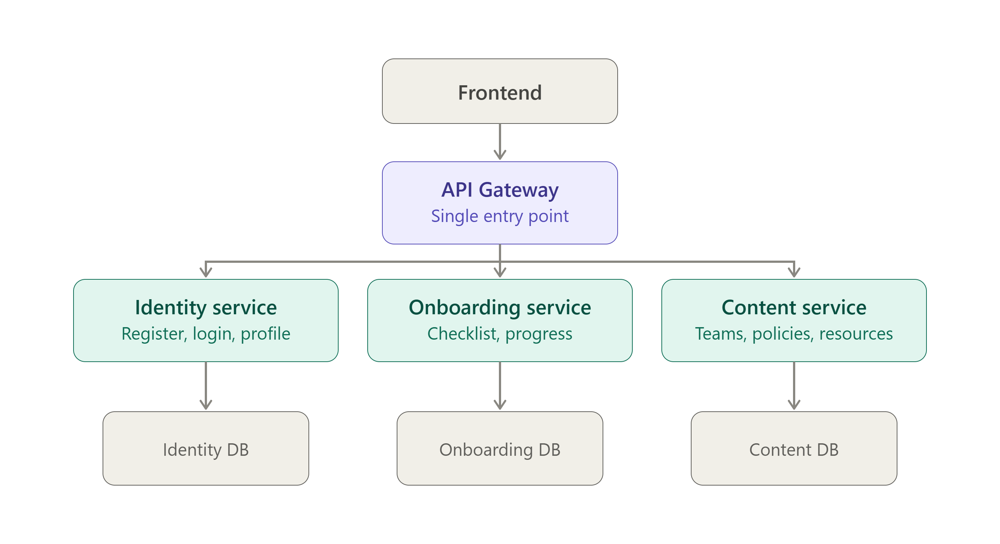

# New Joiner Portal

A small internal portal for a new employee's first days: register/login, view an
onboarding checklist and track progress, and browse basic company info (teams,
contacts, policies, learning resources).

## Structure
- `identity-service/` — Identity Service
- `onboarding-service/` — Onboarding Service
- `content-service/` — Content Service
- `gateway/` — API Gateway (frontend talks only to this)
- `infra/` — Docker Compose, Postgres setup
- `docs/` — architecture diagram, API docs

## Conventions
- No direct commits to `main` — branch per task, PR to merge.

## Architecture

The frontend talks only to the API Gateway, which routes to three independent
services — Identity, Onboarding, Content — each with its own database.
